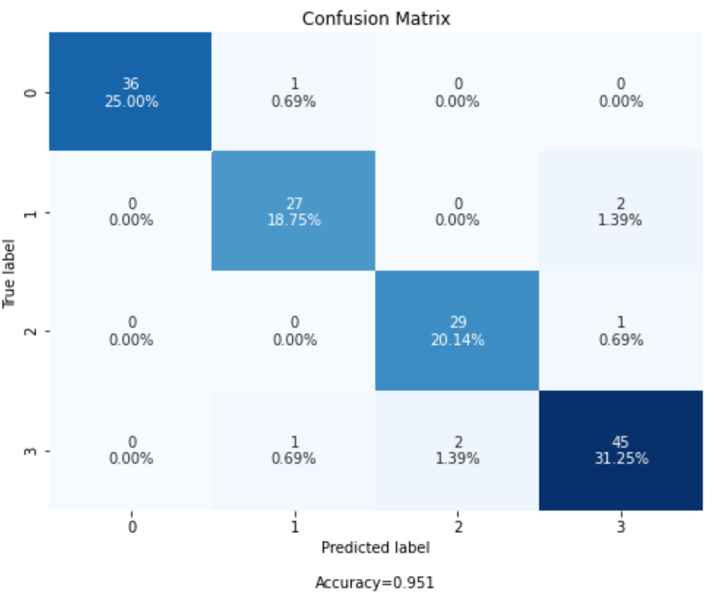

meta-self-learner
=================

**Meta-Self-Learner**

GitHub: https://github.com/ajayarunachalam/meta-self-learner

About
=====

Meta-Self-Learn aims to provide several ensemble learners functionality for quick predictive modeling. Generally, predictions becomes unreliable when the input sample is out of the training distribution, bias to data distribution or error prone to noise, and so on. Current approaches require changes to the network architecture, fine tuning, balanced data, increasing model size, etc. Also, the selection of the algorithm plays a vital role, while the scalability and learning ability decrease with the complex datasets. With this package, I develop an ensemble framework for minimizing generalization error in the learning algorithm irrespective of the data distribution, number of classes, choice of algorithm, number of models, complexity of the datasets. So, in summary we can be able to generalize better. One of the key take-away of this package is building models in more stable fashion while minimizing under-fitting/over-fitting which is very critical to the overall outcome. 

The first layer comprises of several individual classifiers. We have used the base classifiers namely Logistic Regression (LR), K-Nearest Neighbor (KNN), Random Forest (RF), Support Vector Machine (SVM), Extra Tree Classifier (ETC), and Gradient Boosting Machines (GBM). The two self-learners (i.e., Ensemble-1 and Ensemble-2) aim to find the optimal coefficients that minimize the objective function, i.e., the log-loss function. With given set of predictions obtained in the previous layer, the two meta-learner define two different linear problems, and aim to optimize the objective function to find the optimal coefficients that lower's the loss.

Basic workflow
--------------

The designed model pipeline workflow is as given in the figure. 

The pre-processed data is input to Layer-1 of the model. 'T' and 'P' represent training data and predictions, respectively. In Layer-1, many standalone base learns are used. Input to Layer-2 includes the predictions from previous Layer-1. Two meta-self-learner ensemble schemes are used. Layer-3 combines the results from the Layer-2 predictions as a simple weighted average (WA). Model evaluation, and result interpretation is done finally in the last stage of the pipeline.

The details of the meta-self learning architecture is as follows:-

LAYER-1:
--------
Six classifiers are used (LR, SVM, RF, ETC, GBM, and KNN).
All the classifiers are applied twice:
1) The classifiers are trained on (X_train, y_train), and used to predict the class probabilities of (X_valid).
2) The classifiers are trained on (X = (X_train + X_valid), y= (y_train + y_valid)) and used to predict the class probabilities of (X_test).

LAYER-2:
--------
The prediction from the previous layer on X_valid are concatenated, and used to create a new training set (XV, y_valid). The predictions on X_test are concatenated to create new test set (XT, y_test). The two proposed ensemble methods, and their calibrated versions are trained on (XV, y_valid), and used to predict the class probabilities of (XT).

LAYER-3:
--------

The predictions from the previous layer-2 are then linearly combined using weighted average.

In this way, a hybrid model is designed & deployed, where the predictions of the standalone classifier are combined by meta self learner methods, thereby reducing the risk of under-fitting/over-fitting.

Requirements
============

-  **Python 3.6.x**
-  NumPy[>=1.9.0]
-  SciPy[>=0.14.0]
-  Scikit-learn[>=0.16]
-  Pandas[>=0.23.0]
-  Tabulate[>=0.8.9]
-  Xgboost[>=1.4.1]
-  Six
-  Matplotlib
-  Plot-metric

Quickly Setup package with automation scripts
=============================================

.. code:: bash

    sudo bash setup.sh

Installation
------------
Using pip:

.. code:: sh

    pip install meta-self-learner

Using notebook:

.. code:: sh

    !pip install meta-self-learner

Get started
===========

The META-SELF-LEARNER introduces layered network architecture:

-  **DEMO:**

Example MultiClass Classification
---------------------------------

Simple meta-self-learner
~~~~~~~~~~~~~~~~~~~~~~~~

Let's load a simple dataset, make a train & test set and deploy the Meta Self Learner Model:

.. code:: python

    __author__ = 'Ajay Arunachalam'
    __version__ = '0.0.1'
    __date__ = '25.4.2021'

    # load libraries
    import os
    import pandas as pd
    import numpy as np
    import matplotlib.pylab as plt
    %matplotlib inline
    from sklearn.datasets import load_digits # example dataset
    from sklearn.model_selection import train_test_split
    from sklearn.linear_model import LogisticRegression
    from sklearn.ensemble import RandomForestClassifier, GradientBoostingClassifier, ExtraTreesClassifier
    from sklearn.svm import SVC
    from sklearn.neighbors import KNeighborsClassifier
    from sklearn.calibration import CalibratedClassifierCV
    from sklearn.cross_validation import train_test_split
    from sklearn.linear_model import LogisticRegressionCV
    from tabulate import tabulate
    from xgboost import XGBClassifier

    # load in-built package functions
    from MetaLearning import *
    from plot_metric.functions import MultiClassClassification
    from cf_matrix import make_confusion_matrix

    #fixing random state
    random_state=123

    # Load dataset (we just selected 4 classes of digits)
    X, Y = load_digits(n_class=4, return_X_y=True)

    print(f'Predictors: {X}')

    print(f'Outcome: {Y}')

    # Add noisy features to make the problem more harder
    random_state = np.random.RandomState(123)
    n_samples, n_features = X.shape
    X = np.c_[X, random_state.randn(n_samples, 1000 * n_features)]

    ## Spliting data into train and test sets.
    X, X_test, y, y_test = train_test_split(X, Y, test_size=0.2, 
                                            random_state=123)
        
    ## Spliting train data into training and validation sets.
    X_train, X_valid, y_train, y_valid = train_test_split(X, y, test_size=0.25, 
                                                          random_state=1)

    print('Data shape:')
    print('X_train: %s, X_valid: %s, X_test: %s \n' %(X_train.shape, X_valid.shape, 
                                                      X_test.shape))

    # Create list to store logloss of individual classifiers (single classifier) & meta self-learners
    ll_sc, ll_ensemble1, ll_ensemble2, ll_ensemble1_cc, ll_ensemble2_cc, ll_ensemble3, ll_lr, ll_gb = [[] for i in range(8)]

    #Defining the classifiers
    clfs = {'LR'  : LogisticRegression(random_state=random_state), 
            'SVM' : SVC(probability=True, random_state=random_state), 
            'RF'  : RandomForestClassifier(n_estimators=100, n_jobs=-1, 
                                           random_state=random_state), 
           'GBM' : GradientBoostingClassifier(n_estimators=50, 
                                              random_state=random_state), 
            'ETC' : ExtraTreesClassifier(n_estimators=100, n_jobs=-1, 
                                         random_state=random_state),
            'KNN' : KNeighborsClassifier(n_neighbors=30)}
        
    #predictions on the validation and test sets
    p_valid = []
    p_test = []

    ########################### LAYER 1 ##########################
    '''
    First layer (individual classifiers)
    All classifiers are applied twice:
    Training on (X_train, y_train) and predicting on (X_valid)
    Training on (X, y) and predicting on (X_test)
    We can add / remove classifiers or change parameter values to see the effect on final results.
    '''
    print('Performance of individual classifiers (1st layer) on X_test')   
    print('------------------------------------------------------------')

    for lg, clf in clfs.items():
        #First run. Training on (X_train, y_train) and predicting on X_valid.
        clf.fit(X_train, y_train.ravel())
        yv = clf.predict_proba(X_valid)
        p_valid.append(yv)

        # second run. Training on (X, y) and predicting on X_test.
        clf.fit(X, y.ravel())
        yt= clf.predict_proba(X_test)
        p_test.append(yt)

        # print the performance for each classifier
        print('{:10s} {:2s} {:1.7f}'. format('%s:' %(lg), 'logloss =>', log_loss(y_test, yt)))
        #Saving the logloss score
        ll_sc.append(log_loss(y_test, yt)) #Saving the logloss score
    print('')

    # Configure the number of class to input into the model

    NUM_CLASS = MetaEnsemble.set_config(NUM_CLASS=4) # Enter your number of classes in the dataset here

    # Using Ensemble1 and Ensemble2 in a THREE-LAYERED META LEARNER architecture.

    ########################### LAYER 2 ##########################
    '''
    (optimization based ensembles)
    Predictions on X_valid are used as training set (XV) and predictions on X_test are used as test set (XT). 
    Ensemble1, Ensemble2 and their calibrated versions are applied.
    '''
    print('Performance of optimization based meta self-learners (2nd layer) on X_test')
    print('------------------------------------------------------------')
    #Creating the data for the 2nd layer.

    XV = np.hstack(p_valid)
    XT = np.hstack(p_test)

    # Ensemble1

    en1 = MetaEnsemble.Ensemble_one(NUM_CLASS) # as we have 26 classes n_classes=26
    en1.fit(XV, y_valid.ravel())
    w_en1 = en1.w
    y_en1 = en1.predict_proba(XT)
    print('{:20s} {:2s} {:1.7f}'.format('Ensemble1:', 'logloss =>', log_loss(y_test, y_en1)))
    ll_ensemble1.append(log_loss(y_test, y_en1)) #Saving the logloss score

    #Calibrated version of Ensemble1

    cc_en1 = CalibratedClassifierCV(en1, method='isotonic')
    cc_en1.fit(XV,y_valid.ravel())
    y_cc_en1 = cc_en1.predict_proba(XT)
    print('{:20s} {:2s} {:1.7f}'.format('Calibrated_Ensemble1:', 'logloss =>', log_loss(y_test, y_cc_en1)))
    ll_ensemble1_cc.append(log_loss(y_test, y_cc_en1)) #Saving the logloss score

    # Ensemble2

    en2 = MetaEnsemble.Ensemble_two(NUM_CLASS) # as we have 26 classes n_classes=26
    en2.fit(XV,y_valid.ravel())
    w_en2 = en2.w
    y_en2 = en2.predict_proba(XT)
    print('{:20s} {:2s} {:1.7f}'.format('Ensemble2:', 'logloss =>', log_loss(y_test, y_en2)))
    ll_ensemble2.append(log_loss(y_test, y_en2)) #Saving the logloss score

    #Calibrated version of Ensemble2

    cc_en2 = CalibratedClassifierCV(en2, method='isotonic')
    cc_en2.fit(XV,y_valid.ravel())
    y_cc_en2 = cc_en2.predict_proba(XT)
    print('{:20s} {:2s} {:1.7f}'.format('Calibrated_Ensemble2:', 'logloss =>', log_loss(y_test, y_cc_en2)))
    ll_ensemble2_cc.append(log_loss(y_test, y_cc_en2)) #Saving the logloss score
    print('')

    ############# Third layer (weighted average) ######################################
    # Simple weighted average of the previous 4 predictions.
    print('Performance of agggregation of the self-learners (3rd layer) on X_test')
    print('------------------------------------------------------------')
    y_thirdlayer = (y_en1 * 4./9.) + (y_cc_en1 * 2./9.) + (y_en2 * 2./9.) + (y_cc_en2 * 1./9.)
    print('{:20s} {:2s} {:1.7f}'.format('3rd_layer:', 'logloss =>', log_loss(y_test, y_thirdlayer)))
    ll_ensemble3.append(log_loss(y_test, y_thirdlayer))

    '''
    # Plotting the weights of each ensemble
    In the case of Ensemble1, there is a weight for each prediction 
    and in the case of Ensemble2 there is a weight for each class for each prediction.
    '''
    from tabulate import tabulate
    print(' Weights of Ensemble1:')
    print('|---------------------------------------------|')
    wA = np.round(w_en1, decimals=2).reshape(1,-1)
    print(tabulate(wA, headers=clfs.keys(), tablefmt="orgtbl"))
    print('')
    print(' Weights of Ensemble2:')
    print('|-------------------------------------------------------------------------------------------|')
    wB = np.round(w_en2.reshape((-1,NUM_CLASS)), decimals=2) # 26 is no. of classes (NUM_CLASS)
    wB = np.hstack((np.array(list(clfs.keys()), dtype=str).reshape(-1,1), wB))
    print(tabulate(wB, headers=['y%s'%(i) for i in range(NUM_CLASS)], tablefmt="orgtbl"))

    '''
    Comparing the ensemble results with sklearn LogisticRegression based stacking of classifiers.
    Both techniques Ensemble1 and Ensemble2 optimizes an objective function. 
    In this experiment I am using the multi-class logloss as objective function. 
    Therefore, the two proposed methods basically become implementations of LogisticRegression. The following
    code allows to compare the results of sklearn implementation of LogisticRegression with the proposed ensembles.
    '''
    #By default the best C parameter is obtained with a cross-validation approach, doing grid search with
    #10 values defined in a logarithmic scale between 1e-4 and 1e4.
    #Change parameters to see how they affect the final results.

    # LogisticRegression
    lr = LogisticRegressionCV(Cs=10, dual=False, fit_intercept=True,
        intercept_scaling=1.0, max_iter=100,
        multi_class='ovr', n_jobs=1, penalty='l2',
        random_state=random_state,
        solver='lbfgs', tol=0.0001)

    lr.fit(XV, y_valid.ravel())
    y_lr = lr.predict_proba(XT)
    print('{:20s} {:2s} {:1.7f}'.format('Logistic_Regression:', 'logloss =>', log_loss(y_test, y_lr)))
    ll_lr.append(log_loss(y_test, y_lr)) #Saving the logloss score
    print('')

    '''
    Comparing the ensemble results with sklearn GradientBoost based stacking of classifiers.
    Both techniques Ensemble1 and Ensemble2 optimizes an objective function. 
    In this experiment I am using the multi-class logloss as objective function. 
    '''
    from xgboost import XGBClassifier
    # Gradient boosting
    xgb = XGBClassifier(max_depth=5, learning_rate=0.1,n_estimators=10000, objective='multi:softprob',seed=random_state)

    # Computing best number of iterations on an internal validation set
    XV_train, XV_valid, yv_train, yv_valid = train_test_split(XV, y_valid, test_size=0.15, random_state=random_state)
    xgb.fit(XV_train, yv_train, eval_set=[(XV_valid, yv_valid)],
            eval_metric='mlogloss',
            early_stopping_rounds=15, verbose=False)
    xgb.n_estimators = xgb.best_iteration
    xgb.fit(XV, y_valid.ravel())
    y_gb = xgb.predict_proba(XT)
    print('{:20s} {:2s} {:1.7f}'.format('Gradient_Boost:', 'logloss =>', log_loss(y_test, y_gb)))
    ll_gb.append(log_loss(y_test, y_gb)) #Saving the logloss score
    print('')

    print(f'Log-Loss for Base Learners:')
    print(f'{ll_sc}')

    # Comparison of the 3L ENSEMBLE techniques (Ensemble1, Ensemble2, Ensemble3) with Ensemble Logistic & Ensemble XGBOOST (plotting the results)
    #classes = 4

    ll_sc = np.array(ll_sc).reshape(-1, len(clfs)).T
    #print(ll_sc)
    ll_ensemble1 = np.array(ll_ensemble1)
    ll_ensemble2 = np.array(ll_ensemble2)
    ll_ensemble3 = np.array(ll_ensemble3)
    ll_ensemble1_cc = np.array(ll_ensemble1_cc)
    ll_ensemble2_cc = np.array(ll_ensemble2_cc)
    ll_lr = np.array(ll_lr)
    ll_gb = np.array(ll_gb)

    plt.figure(figsize=(10,10))
    plt.plot(ll_sc, color='black', label='Single_Classifiers')

    for i in range(1, 6):
        plt.plot(ll_sc[i], color='black')
    plt.title('Log-loss of the different models.')
    plt.xlabel('Testing on LDIGITS DATASET with only 4 classes')
    plt.ylabel('Log-loss')
    plt.grid(True)
    plt.legend(loc=1)
    plt.show()

    plt.title('Log-loss of the different models.')
    plt.xlabel('Testing on DIGITS DATASET with only 4 classes')
    plt.ylabel('Log-loss')
    plt.plot(ll_lr, 'bo-', label='EN_LogisticRegression', )
    plt.plot(ll_gb, 'mo-', label='EN_XGBoost')
    plt.plot(ll_ensemble1, 'yo-', label='Ensemble1')
    plt.plot(ll_ensemble1_cc, 'ko-', label='Calibrated Ensemble1')
    plt.plot(ll_ensemble2, 'go-', label='Ensemble2')
    plt.plot(ll_ensemble2_cc, 'ko-', label='Calibrated Ensemble2')
    plt.plot(ll_ensemble3, 'ro-', label='Ensemble_3rd_layer')

    plt.grid(True)
    plt.legend(loc=1)
    plt.show()

    print(np.argmax(y_thirdlayer, axis=1))
    y_pred_meta_self_learner = np.argmax(y_thirdlayer, axis=1)

    print(f'Predictions from the final layer:')
    print(f'{y_pred_meta_self_learner}')

    #Get the confusion matrix
    cf_matrix = confusion_matrix(y_test, y_pred_meta_self_learner)
    print(cf_matrix)
    make_confusion_matrix(cf_matrix, figsize=(8,6), cbar=False, title='Confusion Matrix')

    # Visualisation of plots
    mc = MultiClassClassification(y_test, y_thirdlayer, labels=[0, 1, 2, 3])
    plt.figure(figsize=(13,4))
    plt.subplot(131)
    mc.plot_roc()
    plt.subplot(132)
    mc.plot_confusion_matrix()
    plt.subplot(133)
    mc.plot_confusion_matrix(normalize=True)

    plt.savefig('figures/images/plot_multi_classification.png')
    plt.show()

    mc.print_report()

Full Demo
=========
## Important Links
------------------
- Find the full Notebook for the above illustration here : https://github.com/ajayarunachalam/meta-self-learner/blob/main/Full_Demo_Tested.ipynb

To Launch Above Illustration on Terminal
----------------------------------------
Using Terminal:

.. code:: sh

    python tested_example.py

License
=======
Copyright 2021-2022 Ajay Arunachalam <ajay.arunachalam08@gmail.com>

Permission is hereby granted, free of charge, to any person obtaining a copy of this software and associated documentation files (the "Software"), to deal in the Software without restriction, including without limitation the rights to use, copy, modify, merge, publish, distribute, sublicense, and/or sell copies of the Software, and to permit persons to whom the Software is furnished to do so, subject to the following conditions:

The above copyright notice and this permission notice shall be included in all copies or substantial portions of the Software.

THE SOFTWARE IS PROVIDED "AS IS", WITHOUT WARRANTY OF ANY KIND, EXPRESS OR IMPLIED, INCLUDING BUT NOT LIMITED TO THE WARRANTIES OF MERCHANTABILITY, FITNESS FOR A PARTICULAR PURPOSE AND NONINFRINGEMENT. IN NO EVENT SHALL THE AUTHORS OR COPYRIGHT HOLDERS BE LIABLE FOR ANY CLAIM, DAMAGES OR OTHER LIABILITY, WHETHER IN AN ACTION OF CONTRACT, TORT OR OTHERWISE, ARISING FROM, OUT OF OR IN CONNECTION WITH THE SOFTWARE OR THE USE OR OTHER DEALINGS IN THE SOFTWARE. © 2021 GitHub, Inc.

